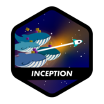

<h3 align="center">👋 Hi there!</h3>
<h3 align="center">I'm Luiz Lima Cezario.</h3>

  <a href="https://www.linkedin.com/in/luiz-lima-cezario/">Linkedin</a> •
  <a href="https://discordapp.com/users/340199911821934592">Discord</a> •
  <a href="https://www.instagram.com/luiz.l.cezario">Instagram</a>

Student of 42 and UFABC passionate about programming, passionate about learning new languages, and trying new things.

---

- 💻 I'm  studying at [UFABC](https://www.ufabc.edu.br/) and studying at [École 42](https://www.42.fr/) - [São Paulo unit](https://www.42sp.org.br/)
- ⚙️ I use daily:  `.c`, `.js`, `.html`, `.css`, `.json`
- 🌱 Learning all about **C**
- 📫 Reach me: luizlcezario@gmail.com or [Luiz Discod](https://discordapp.com/users/340199911821934592)

---
 
 
<h2 align="center">🏆 42 badges 🏆</h2>

<h3 align="center"> 🥉 phase 1 🥉</h3>

 
 
 

 
 
<h3 align="center">🥈 phase 2 🥈</h3>

 

 
 
<h3 align="center">🥇 phase 3 🥇</h3>

 
 

---

---
 

  </a>
   
   
  </a>

---

> *No matter where you go, everyone’s connected. – Lain Iwakura*

<!--
**Yaten/Yaten** is a ✨ _special_ ✨ repository because its `README.md` (this file) appears on your GitHub profile.

Here are some ideas to get you started:

- 🔭 I’m currently working on ...
- 🌱 I’m currently learning ...
- 👯 I’m looking to collaborate on ...
- 🤔 I’m looking for help with ...
- 💬 Ask me about ...
- 📫 How to reach me: ...
- 😄 Pronouns: ...
- ⚡ Fun fact: ...
-->
